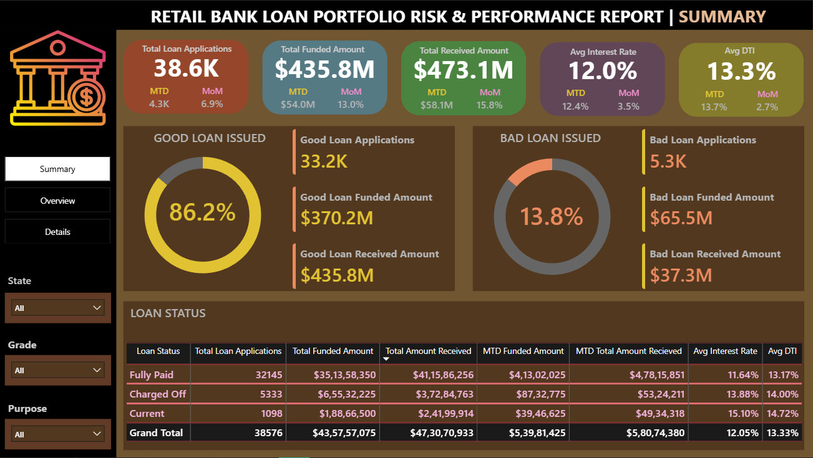
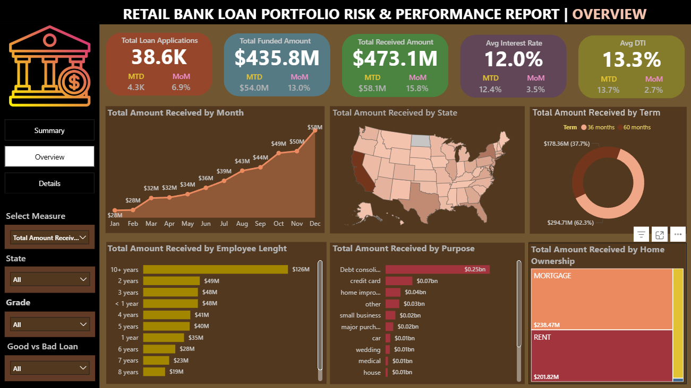
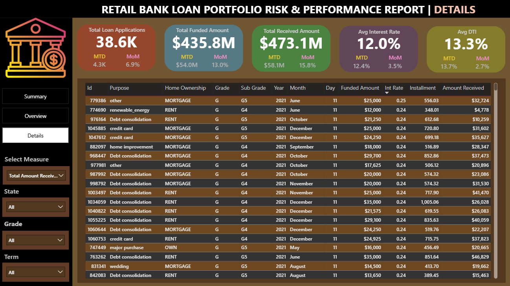

# Bank Loan Performance Analysis
In this project, I analyzed a retail bank loan dataset to understand loan performance, portfolio risk, and repayment behavior,and potential risk factors.
The goal was to explore trends in loan applications, funded amounts, repayments, and risky loans.
I used SQL for data analysis and Power BI to build interactive dashboards that visualize loan performance and risk indicators.

## Project Overview
In this project I analyzes Bank Loan data to understand Loan Performance, Repayment Behavior, and Potential Risk Factors.
The dataset contains 38,567 loan records. SQL was used to explore and analyze the data, and Power BI was used to build an interactive dashboard to monitor loan performance.

## Tools Used
- SQL – data querying and analysis
- Power BI – dashboard creation and data visualization

## Dataset
The dataset includes 38,567 loan records containing information about:
- Loan amount
- Interest rate
- Borrower income
- Loan status
- Loan purpose
- Employment length
  
## Dashboard
I built this Power BI dashboard Summarizes **Loan Applications, Funded Amounts, Repayment Performance, and Risk Indicators**.

**Loan Portfolio Summary Dashboard**
This dashboard focuses on **loan quality and risk** by comparing good loans and bad loans.
- Percentage of good vs bad loans
- Total funded amount for good and bad loans
- Loan repayment amounts
- Loan status breakdown (Fully Paid, Charged Off, Current)

**Loan Portfolio Overview Dashboard**
This dashboard shows the **overall performance of the loan portfolio**, including Total Loan Applications, Funded Amount, Total Received Amount, Interest Rate, and Debt-to-Income Ratio.
It also highlights trends such as:
- Monthly loan repayment trends
- Loan distribution by state
- Loan term comparison (36 vs 60 months)
- Loan purpose analysis
- Loan amount distribution based on employment length and home ownership

**Loan Portfolio Detail Dashboard**

## Key KPIs
- Total Loan Applications:**38.6K**
- Total Funded Amount:**$435.8M**
- Total Received Amount:**$473.1M**
- Average Interest Rate:**12.0%**
- Average Debt-to-Income (DTI):**13.3%**

## Key Insights
- The bank processed around 38.6K loan applications, with a total funded amount of **$435.8M**.
- The total amount received from borrowers is **$473.1M**, showing overall positive repayment performance.
- Around 86.2% of loans are good loans, while **13.8%** are classified as bad loans.
- Loans with **longer employment history tend to receive higher funded amounts**.
- **Debt consolidation** loans are the most common loan purpose, indicating customers mainly borrow to manage existing debt.

## Business Recommendations
- Monitor loans with higher risk indicators such as high DTI or lower credit grades.
- Improve risk assessment for loans that may lead to charge-offs.
- Focus on borrower profiles that historically show strong repayment behavior.
- Track loan performance regularly using dashboards to detect portfolio risks early.

## Project Workflow
1. Data exploration and analysis using SQL
2. Identified key metrics such as loan applications, funded amount, repayment amount, interest rate, and DTI
3. Built Power BI dashboards to visualize loan performance and risk indicators
4. Generated insights to understand loan portfolio health and potential risks.

## Project Structure
- **data/** – contains the raw loan dataset
- **sql/** – SQL queries used for data analysis
- **dashboard/** – Power BI dashboard screenshot
- **reports/** – SQL query results with screenshots

## Skills Used
- SQL data analysis
- Data aggregation and KPI calculation
- Financial data analysis
- Power BI dashboard development
- Business insight generation
